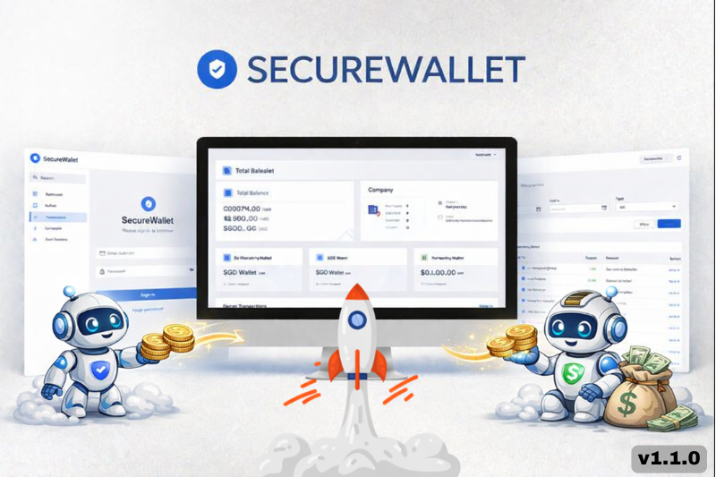

# Secure Business Wallet Management

This repository contains a simplified internal wallet management system for a fintech use case. It provides admin tools for wallet control, transaction visibility, and team access management. The current scope supports one company, with a design that enables future scalability. 

For completeness, I’ve provided the changelog for the latest version rollout v1.1.0 [Changelog](https://secure-wallet-jet.vercel.app/changelog)

## Tech Stack

- **Backend**: Laravel 12 (PHP 8.4+)
- **Frontend**: Vue 3 + Vuetify
- **API Style**: REST (JSON)
- **Auth**: Laravel Sanctum (Token-based)
- **Database**: MySQL / SQLite (for unit testing)
- **Testing**: PHPUnit, Vitest

## Demo

- **Live Demo**: [https://secure-wallet-jet.vercel.app/](https://secure-wallet-jet.vercel.app/)

## Data For Testing

User Accounts (Login Credentials):
- [ Demo User Accounts ](https://docs.google.com/spreadsheets/d/1VjZgWQA9DU4YxbEs9A6fwGaqSYv-V46Ti_gSKJxNf0Y/edit?gid=1011573278#gid=1011573278)

Wallets (Including Pre-seeded External Wallets):
- [ Demo Wallets ](https://docs.google.com/spreadsheets/d/1VjZgWQA9DU4YxbEs9A6fwGaqSYv-V46Ti_gSKJxNf0Y/edit?gid=1644118482#gid=1644118482)

## Demo Videos & Testing Coverage
To make the review easier, I’ve included short demo videos below that walk through the main features and flows of the application. 📹 [Watch Demo Videos](docs/part-2/demo-video.md)

## Documentation & Architecture

Additionally, I’ve included some supporting design materials below to provide more context on the overall architecture and future extensibility:

### 1. Transfer Flow – Flowchart
- **[Flowchart](docs/part-2/transfer-flow-chart.md)**: I created a flowchart to validate the logic, especially for the Transfer feature, which includes multiple conditions and edge cases. 

### 2. Transfer Flow – System Design Diagram
- **[System Design Diagram](docs/part-2/transfer-system-design.md)**: Since the FX service (currency exchange) is not yet available, I designed the system with future extensibility in mind and included a conceptual approach for potential integration. This is intended as an ideation for future implementation.

### 3. Transfer Flow – Sequence Diagram
- **[Transfer Flow – Sequence Diagram](docs/part-2/transfer-sequence-diagram.md)**: This diagram illustrates the end-to-end flow of the transfer process and interactions between components.

### 4. Database ER Diagram
- **[Database ER Diagram](docs/part-2/er-diagram-v2.md)**: This diagram shows the database relationships and overall data structure.

### 5. About Backend Project
- **[Backend Readme](backend/README.md)**: Detailed information about the backend technology, project structure, and how it works.

### 6. About Frontend Project
- **[Frontend Readme](frontend/README.md)**: Detailed information about the frontend technology, project structure, and how it works.

### 7. API Documentation
- **[API Setup](docs/api-setup.md)**: Instructions on how to import the Postman collection and explore available APIs.

