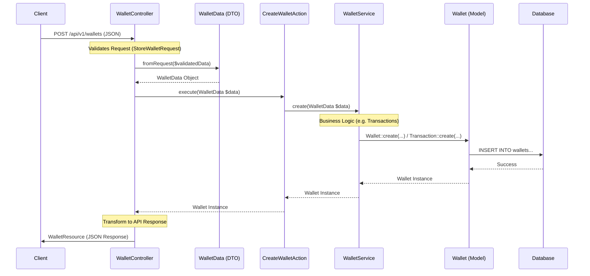
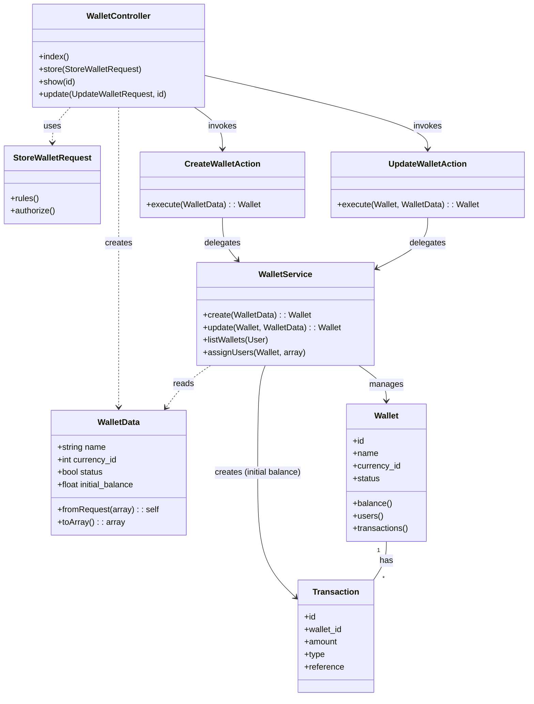
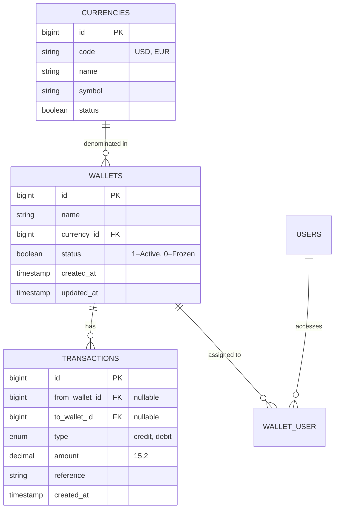

<p align="center"><a href="https://laravel.com" target="_blank"></a></p>

<p align="center">
<a href="https://github.com/laravel/framework/actions"></a>
<a href="https://packagist.org/packages/laravel/framework"></a>
<a href="https://packagist.org/packages/laravel/framework"></a>
<a href="https://packagist.org/packages/laravel/framework"></a>
</p>


## Project Structure

The project follows a Domain-Driven Design (DDD) inspired structure within Laravel.

```
app/
├── Domain/                 # Core Business Logic & Models
│   ├── Auth/               
│   │   ├── Actions/        # Single Responsibility Actions
│   │   ├── DataTransferObjects/ # Strict DTOs
│   │   └── Services/       # Business Logic Services
│   ├── User/
│   │   ├── Models/         # Eloquent Models
│   │   └── ...
│   ├── Wallet/
│   │   ├── Models/
│   │   ├── Actions/
│   │   ├── Services/
│   │   └── DataTransferObjects/
│   └── Currency/
│       └── ...
├── Http/
│   ├── Controllers/        # API Controllers (Thin)
│   ├── Requests/           # Form Requests (Validation)
│   └── Resources/          # API Resources (Transformation)
├── Policies/               # Authorization Policies
└── Providers/              # Service Providers
```

# Wallet Module Architecture Flow

This diagram illustrates the data flow and strict typing implementation in the Wallet Module, demonstrating how the Controller, Action, Service, and Data Layers interact.

## Component Roles

1.  **Controller (`WalletController`)**:
    *   Handles HTTP inputs and validation (`StoreWalletRequest`).
    *   **Crucial Step**: Instantly converts validated array data into a strict `WalletData` DTO.
    *   Delegates the business operation to a specific **Action**.
    *   Formats the final response using `WalletResource`.

2.  **DTO (`WalletData`)**:
    *   Acts as a strict contract for data transfer.
    *   Ensures that strictly typed data streams flow into the Action and Service layers, replacing loose associative arrays.

3.  **Action (`CreateWalletAction`)**:
    *   Follows the Single Responsibility Principle.
    *   Orchestrates the operation by calling the `WalletService`.
    *   Strictly accepts `WalletData` as input.

4.  **Service (`WalletService`)**:
    *   Contains the core business logic (e.g., creating the wallet, handling initial balance transactions).
    *   Interacts directly with Eloquent Models.
    *   Strictly accepts `WalletData` as input.

5.  **Model (`Wallet`)**:
    *   Represents the database table structure.

## Interaction Flow



## System Design (Component Structure)

This diagram shows the static structure and dependencies between the classes in the Wallet Module.



## Database Schema (ERD)

Strict database structure for the Wallet Module.


