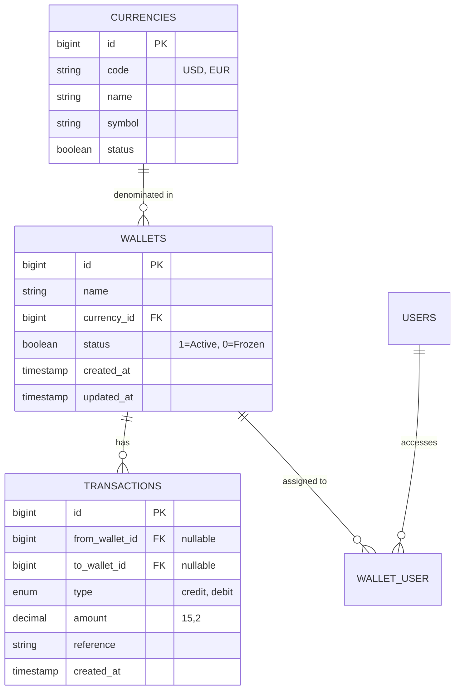

# Entity Relationship Diagram (ERD)

Strict database structure for the Wallet Module and related entities.

```mermaid
erDiagram
    WALLETS ||--o{ TRANSACTIONS : has
    WALLETS ||--o{ WALLET_USER : "assigned to"
    CURRENCIES ||--o{ WALLETS : "denominated in"
    USERS ||--o{ WALLET_USER : "accesses"

    WALLETS {
        bigint id PK
        string name
        bigint currency_id FK
        boolean status "1=Active, 0=Frozen"
        timestamp created_at
        timestamp updated_at
    }

    TRANSACTIONS {
        bigint id PK
        bigint from_wallet_id FK "nullable"
        bigint to_wallet_id FK "nullable"
        enum type "credit, debit"
        decimal amount "15,2"
        string reference
        timestamp created_at
    }

    CURRENCIES {
        bigint id PK
        string code "USD, EUR"
        string name
        string symbol
        boolean status
    }
```
