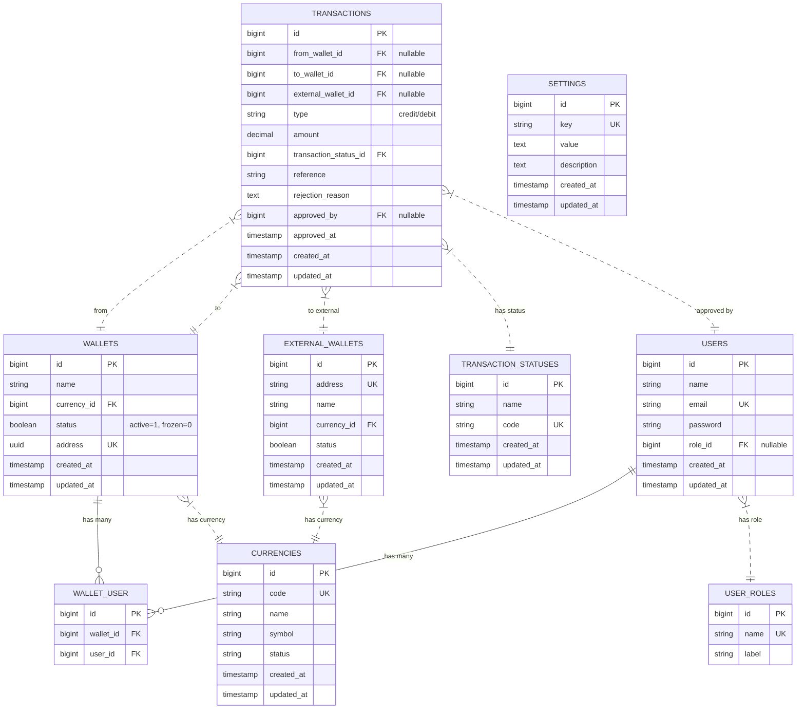

# Entity Relationship Diagram (v2)

This diagram reflects the current database schema, including all relationships and key fields based on the migration files.

```mermaid
erDiagram
    USERS {
        bigint id PK
        string name
        string email UK
        string password
        bigint role_id FK "nullable"
        timestamp created_at
        timestamp updated_at
    }

    USER_ROLES {
        bigint id PK
        string name UK
        string label
    }

    WALLETS {
        bigint id PK
        string name
        bigint currency_id FK
        boolean status "active=1, frozen=0"
        uuid address UK
        timestamp created_at
        timestamp updated_at
    }

    WALLET_USER {
        bigint id PK
        bigint wallet_id FK
        bigint user_id FK
    }

    EXTERNAL_WALLETS {
        bigint id PK
        string address UK
        string name
        bigint currency_id FK
        boolean status
        timestamp created_at
        timestamp updated_at
    }

    CURRENCIES {
        bigint id PK
        string code UK
        string name
        string symbol
        string status
        timestamp created_at
        timestamp updated_at
    }

    TRANSACTIONS {
        bigint id PK
        bigint from_wallet_id FK "nullable"
        bigint to_wallet_id FK "nullable"
        bigint external_wallet_id FK "nullable"
        string type "credit/debit"
        decimal amount
        bigint transaction_status_id FK
        string reference
        text rejection_reason
        bigint approved_by FK "nullable"
        timestamp approved_at
        timestamp created_at
        timestamp updated_at
    }

    TRANSACTION_STATUSES {
        bigint id PK
        string name
        string code UK
        timestamp created_at
        timestamp updated_at
    }

    SETTINGS {
        bigint id PK
        string key UK
        text value
        text description
        timestamp created_at
        timestamp updated_at
    }

    %% Relationships

    USERS ||--o{ WALLET_USER : "has many"
    WALLETS ||--o{ WALLET_USER : "has many"
    
    USERS }|..|| USER_ROLES : "has role"
    
    WALLETS }|..|| CURRENCIES : "has currency"
    EXTERNAL_WALLETS }|..|| CURRENCIES : "has currency"
    
    TRANSACTIONS }|..|| WALLETS : "from"
    TRANSACTIONS }|..|| WALLETS : "to"
    TRANSACTIONS }|..|| EXTERNAL_WALLETS : "to external"
    TRANSACTIONS }|..|| TRANSACTION_STATUSES : "has status"
    TRANSACTIONS }|..|| USERS : "approved by"
```
