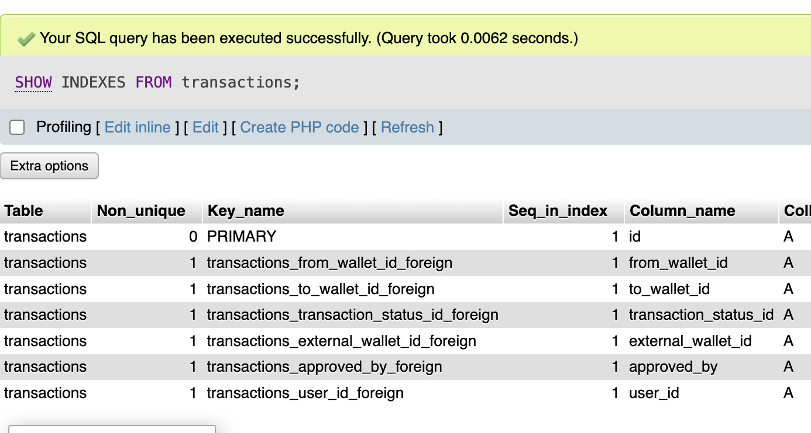
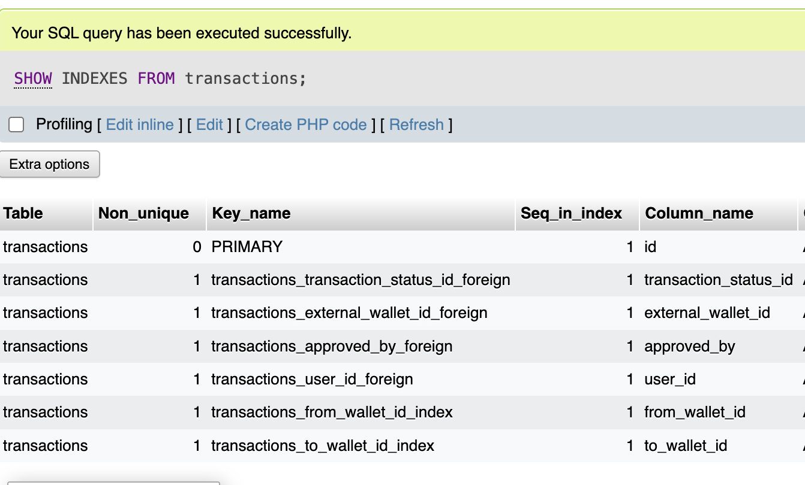
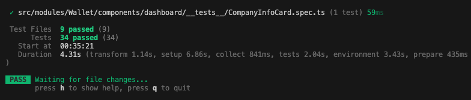

# Modification Notes

## User Cancel Own Transaction
📹 [Watch Video](https://drive.google.com/file/d/1ZDMxaZtLdHphUwPGxmAPui8jiBacCC4f/view?usp=sharing)

## Transaction Table Index

Added an index column to the transactions table for better row readability and quick reference.

### Before

### After

## Additional UI Tests

More UI tests were added to improve confidence in key flows and visual behavior.

### Test Coverage Notes
- Expanded UI test scenarios for transaction-related behavior.
- Added checks for rendering and interaction outcomes in updated UI states.
- Improved confidence that recent UI changes do not regress existing functionality.
