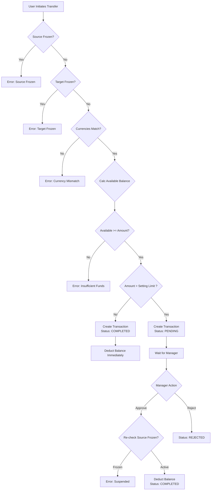

```mermaid
graph TD
    A[User Initiates Transfer] --> B{Source Frozen?}
    B -- Yes --> C[Error: Source Frozen]
    B -- No --> D{Target Frozen?}
    D -- Yes --> E[Error: Target Frozen]
    D -- No --> F{Currencies Match?}
    F -- No --> G[Error: Currency Mismatch]
    F -- Yes --> H{Calc Available Balance}
    H --> I{Available >= Amount?}
    I -- No --> J[Error: Insufficient Funds]
    I -- Yes --> K{Amount > Setting Limit ?}
    K -- Yes --> L[Create Transaction\nStatus: PENDING]
    K -- No --> M[Create Transaction\nStatus: COMPLETED]
    M --> N[Deduct Balance Immediately]
    L --> O[Wait for Manager]
    O --> P{Manager Action}
    P -- Approve --> Q{Re-check Source Frozen?}
    Q -- Frozen --> R[Error: Suspended]
    Q -- Active --> S[Deduct Balance\nStatus: COMPLETED]
    P -- Reject --> T[Status: REJECTED]
```
