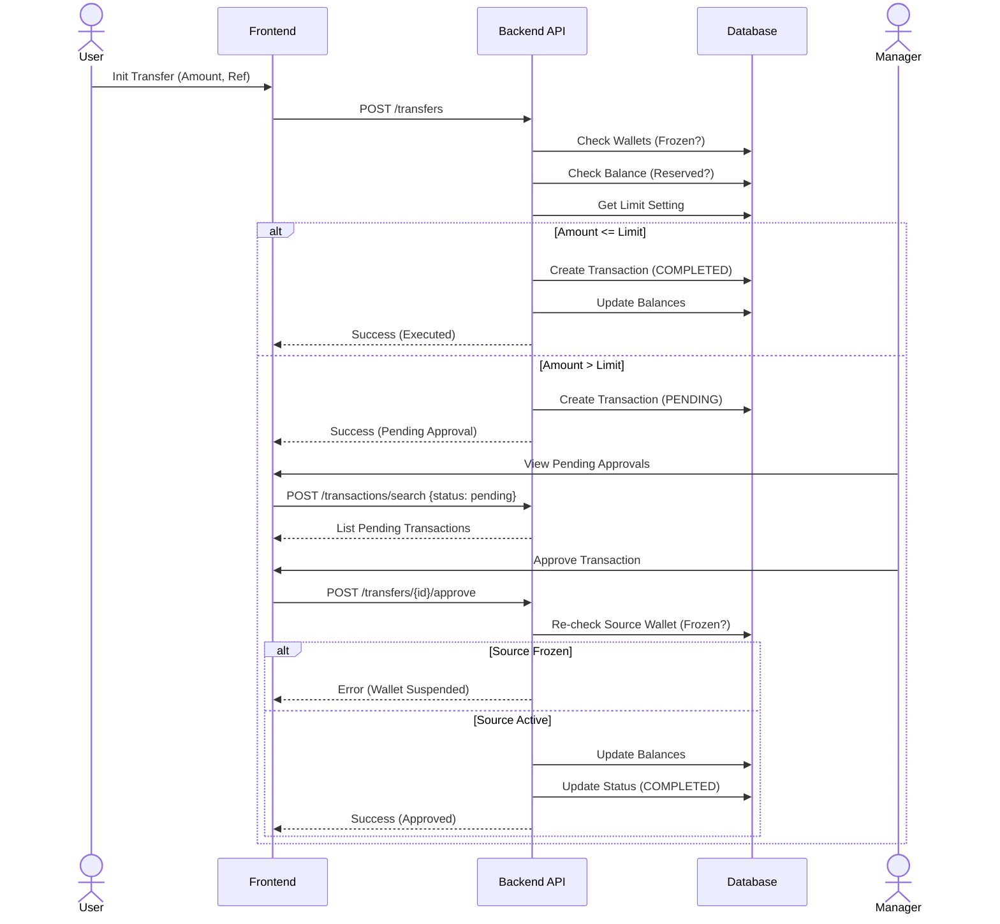

# Transfer Sequence Diagram

This document illustrates the sequence of interactions between the User, Frontend, Backend API, Database, and Manager during a fund transfer.

## Sequence Diagram

## Detailed Steps

1.  **Initiation**: The user submits a transfer request via the Frontend.
2.  **API Processing**: The Backend API (`TransferController`) receives the request.
3.  **Validation**: `TransferService` validates the source wallet (not frozen), checks for sufficient available balance, and retrieves the global transfer limit setting.
4.  **Auto-Approval**: If the amount is within the limit, the transaction is immediately marked as `COMPLETED`, balances are updated, and success is returned.
5.  **Pending Approval**: If the amount exceeds the limit, the transaction is created with `PENDING` status.
6.  **Manager Review**: A Manager views pending transactions (via `POST /transactions/search`).
7.  **Approval Action**: The Manager approves a specific transaction (`POST /transfers/{id}/approve`).
8.  **Re-Validation**: The system *re-checks* if the source wallet is frozen to ensure compliance.
9.  **Completion**: If active, the transaction is `COMPLETED`, balances are updated, and the approval is recorded.
