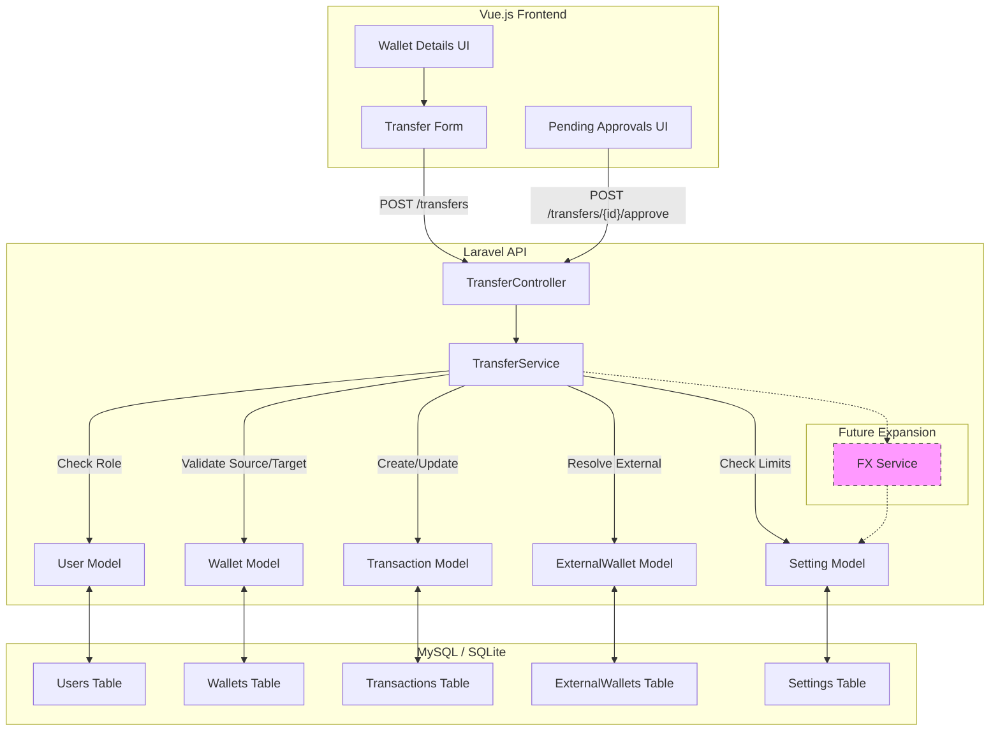

# Transfer System Architecture

This document outlines the high-level architecture for the transfer feature, including the interaction between frontend components, backend services, and the database.

## System Architecture Diagram

## Component Description

### Frontend
- **Transfer Form**: Handles user input for internal and external transfers.
- **Pending Approvals UI**: Interface for managers to view and approve/reject pending transactions.

### Backend
- **TransferController**: Handles HTTP requests for initiating, approving, and rejecting transfers.
- **TransferService**: Contains the core business logic for transfers, including validation, balance checks, limit enforcement, and transaction creation.
- **Models**: Eloquent models (`Wallet`, `Transaction`, `ExternalWallet`, `User`, `Setting`) are used for database interaction.

### Database
- Stores user data, wallet balances, transaction records, external wallet details, and system settings.
