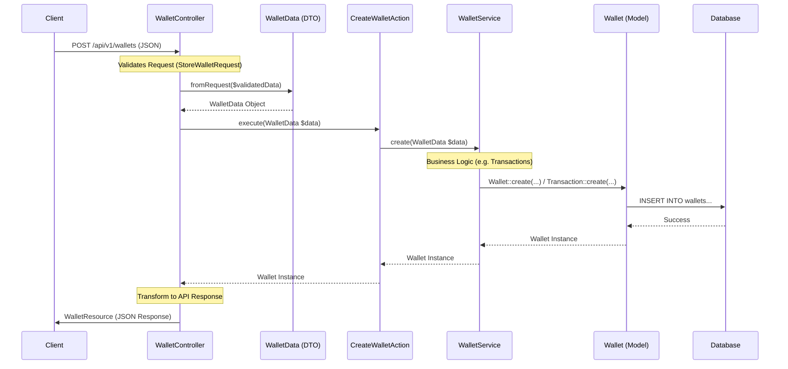
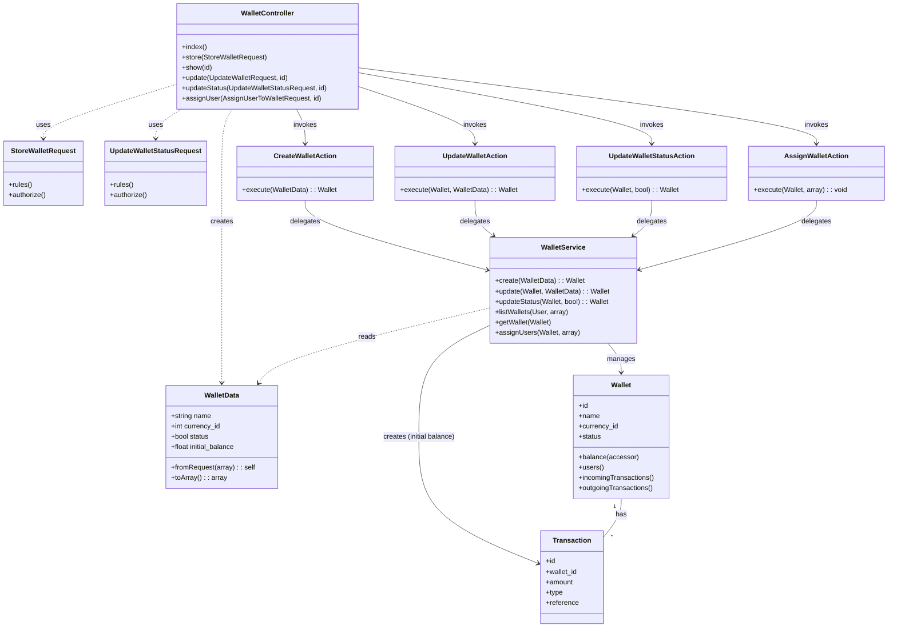

# System Design & Architecture

This document outlines the architectural design of the Secure Wallet application, focusing on the Wallet Module. The system follows a Domain-Driven Design (DDD) inspired structure.

## Overview

The system is designed to be modular, scalable, and strictly typed. It separates concerns into Controllers, Actions, Services, Data Transfer Objects (DTOs), and Models.

## Wallet Module Architecture Flow

This diagram illustrates the data flow and strict typing implementation in the Wallet Module.

### Interaction Flow (Sequence Diagram)

### Component Roles

1.  **Controller (`WalletController`)**: Handles HTTP requests, validation, and response formatting. Instantly converts input to DTOs.
2.  **DTO (`WalletData`)**: Ensures strict data contracts between layers, replacing loose associative arrays.
3.  **Action (`CreateWalletAction`)**: Single Responsibility class that orchestrates the business operation.
4.  **Service (`WalletService`)**: Contains the core business logic and interacts with Eloquent Models.
5.  **Model (`Wallet`)**: Represents the database table and relationships.

## Class Structure (Class Diagram)

This diagram shows the static structure and dependencies between the classes in the Wallet Module.

